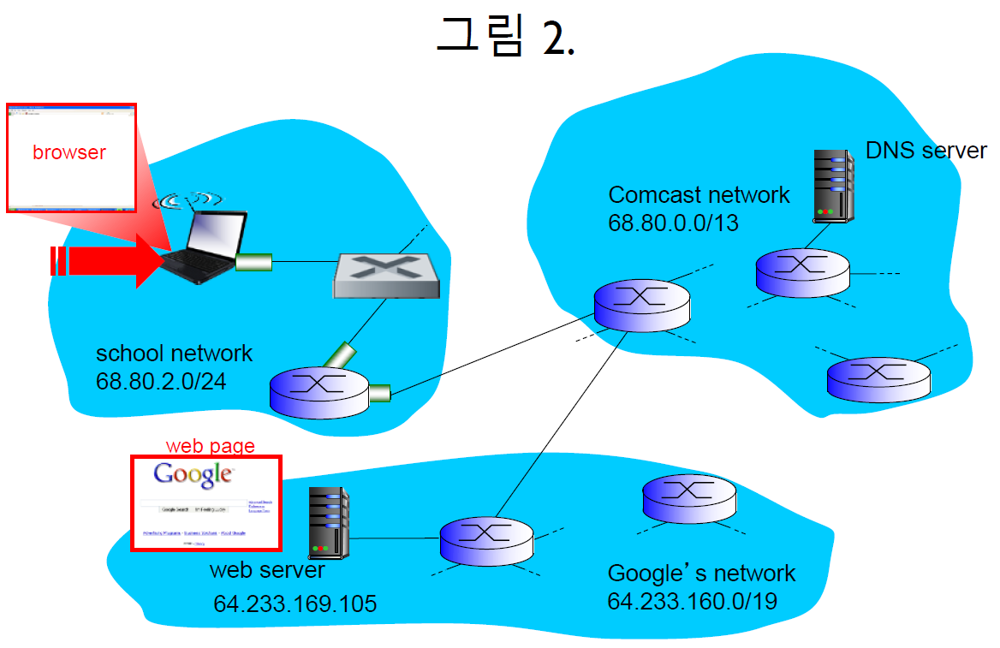

# 네트워크 기초

### 1. IoT란 무엇인가?
~~~
~~~

### 2. Internet Protocol Stack을 구성하는 네트워크 5계층을 설명하시오.
~~~
~~~

### 3. frame, packet, segment, datagram 차이점 (최상위 계층 메시지 M을 기준으로 역순서로 내려오면서 차이점을 설명하세요)
~~~
~~~

### 4. TCP 통신을 하고 있는 host B가 host A로 보내는 패킷안에 sequence number: 200, ACK number: 101이 들어있다고 하자. 이 메시지가 host A로 전달하는 의미가 무엇인지를 설명하시오.
~~~
B가 전송하는 패킷은 Sequence Number 200으로 시작하는 데이터가 들어있으며,
A로부터 Sequence Number 100까지 성공적으로 수신함
~~~

### 5. TCP flow control은 무엇인가?
~~~
수신측 버퍼에서 Overflow가 발생하지 않도록,
송신측의 전송 속도를 조절하는 기법
수신 클라이언트가 수행해 주는 제어 기법
~~~

### 6. TCP congestion control은 무엇인가?
~~~
송신 서버의 데이터 전송과 네트워크의 처리 속도 차이로 인한
네트워크 혼잡을 해결하기 위해 전송 속도를 조절하는 기법
송신 서버가 수행해 주는 제어 기법
~~~

### 7. (ARP, DHCP, DNS, HTTP, TCP 각 프로토콜 포함) 웹서버와 웹브라우저간의 인터넷 동작에 대한 질문이다. 그림 2를 보면, 어떤 학교 망에서 노트북으로 네트워크로 무선 접속한 뒤, 웹브라우저를 통해 구글 웹서버에 접속하여 웹서비스를 받으려고 한다. 

#### 7.1. 노트북를 위한 동적 IP 할당부터, 웹 서비스 요청에서 웹서버 응답을 받을 때까지 진행되는 과정을 링크 계층부터 응용계층까지 포함하여 단계별로 설명하시오. 각 과정에서 프로토콜 동작과정을 구체적으로 설명하시오(ARP, DHCP, DNS, HTTP, TCP 동작설명 포함).
~~~
~~~

### 8. 패킷 캡슐화(Packet Encapsulation)이란 무엇인가?
~~~
네트워크 상위 계층에서 하위 계층으로 내려가면서 
필요한 헤더들이 패킷에 추가되는 것을 말함
~~~

# IoT 프로토콜
### 1. 블루투스의 비콘은 무엇인가?
📌 Beacon 개념:  
~~~
BLE(Bluetooth Low Energy)모드의 블루투스 장치가 
주위의 블루투스 장치에게 connection 없이 
advertising(광고) 패킷을 주기적으로 브로드캐스트하는 통신
~~~

✅ Beacon 특징:  
~~~
1. 저전력: BLE 기반으로 배터리 수명이 김
2. 방향 및 거리 측정 가능: 신호 세기(RSSI)를 활용하여 위치 추정 가능
3. 단방향 브로드캐스트: 연결 없이 신호를 지속적으로 송출
4. 다양한 프로토콜 지원
~~~

### 2. 6LowPAN 프로토콜은 Adaptation(절충) 역할을 담당한다. 이것이 필요한 이유와 이를 구현하는 방법이 무엇인지 설명하시오.
✅ **Adaptation Layer가 필요한 이유:**  
~~~
IPv6는 기본적으로 큰 데이터(MTU 크기: 1280 바이트) 전송을 기대하고 있음
즉, Network Layer(IP)에서 전송할 수 있는 최대 페이로드 크기 (MTU)가 1280 바이트

그런데 IoT 기기들이 쓰는 IEEE 802.15.4 같은 무선 네트워크는 작은 데이터(Frame 최대 크기: 127 바이트)만 전송 가능함
즉, Link Layer에서 전송할 수 있는 최대 데이터 단위 (Frame 최대 크기)가 127 바이트

Adaptation은 이 둘 사이 차이를 절충하는 역할 담당함
~~~

✅ **6LowPAN 주요 기능(구현 방법):**  
~~~
1. 헤더 압축 (IPv6 UDP/ICMP header compression)
    * IPv6의 헤더 40 바이트 -> 헤더를 2 바이트로 줄임

2. 패킷 분할 및 재조립 (Packet Fragmentation & Reassembly)
    * 1280 바이트 같은 큰 IPv6 패킷은 127바이트 단위로 Fragmentation하여 전송
    * 수신 측에서는 Reassembly하여 원래 IPv6 패킷으로 복원함

3. 라우팅 (Routing)
    * 기존의 무거운 IPv6 라우팅 프로토콜 대신, RPL과 같은 경량화된 라우팅 프로토콜 활용
~~~

### 3. MQTT에서 메시지 송수신 방법을 설명하시오(메시지 구분하는 주소 사용 포함).
~~~
Publisher(송신), Subscriber(수신) 간에 메시지 전달이 이루어며,
둘 사이를 중계하는 Broker가 존재함

메시지를 구분하는 주소로 Topic을 사용하며, 
Subscriber는 특정 Topic을 구독하고 Publisher는 Topic에 메시지를 발행함
~~~

### 4. MQTT와 HTTP 동작 방식의 차이점을 설명하시오(비동기/동기 중 어느 방식인지 설명 포함).
~~~
MQTT는 비동기식 통신, Broker라는 서버를 중간에 둔 Publisher-Subscriber 구조로 동작
HTTP는 동기식 통신, 클라이언트가 서버에 요청하면 서버가 응답하는 클라이언트-서버 구조로 동작
~~~

### 5. 전송 프로토콜과 웹인터페이스 사용 여부 관점에서, MQTT와 CoAP 차이점을 설명하시오.
~~~

~~~

### 6. IoT 플랫폼은 무엇인가?
~~~
센서 네트워크, 네트워크, 클라우드 서버 및 응용까지 연결되어,
서비스가 가능하게 해주는 통합 시스템(다중 계층)을 의미함
~~~

### 7. IO multiplexing이란 무엇인가?
~~~
하나의 프로세스(쓰레드)안에서 여러 개의 소켓 IO를 처리하는 것
~~~

### 8. [중요] 블루투스의 Classic Mode와 Smart Mode의 차이점은 무엇인가?
~~~
Classic Mode는 지속적인 연결 유지의 방식(continuous connections)인 반면,
Smart Mode(BLE)는 필요할 때만 연결하는 방식(short burst connections)임
~~~

### 9. [중요] 블루투스의 Notification과 Indication의 차이는 무엇인가?
~~~
둘다 서버가 클라이언트에게 데이터 변경을 알려주는 전송 방식임에서 동일하지만, 

Notification(알림) 전송 방식은 응답(ACK)이 없는 반면,
Indication(인디케이션) 전송 방식은 응답(ACK)이 필수임
~~~

### 10. 블루투스 장치는 2가지 종류의 장치가 있다. Peripheral과 Central에 대해서 설명하시오.
BLE 장치는 아래의 두 가지 역할을 가짐:  
~~~
퍼리퍼럴(Peripheral)은 데이터를 광고(Advertising)하는 장치
센트럴(Central)은 광고 데이터를 스캔(Scanning)하고 연결하는 장치

즉, Central이 Peripheral을 검색하고 연결하여 데이터를 주고받음
~~~

### 11. GATT란 무엇인가? GATT의 구조에 대해서도 설명하시오.
📌 GATT 개념:  
~~~
BLE에서 장치 간 데이터 교환 방식을 정의하는 프로토콜
즉, 데이터를 어떻게 표현하고 교환할지 프로파일(Profile)을 정한 규칙
~~~

✅ GATT 구조:  
~~~
데이터를 서비스(Service)와 특성(Characteristic) 형태로 저장 및 전송함

사비스(Service): 여러 개의 특성(Characteristic)을 포함
특성(Characteristic): 실제 데이터를 포함
~~~

# 소켓 프로그래밍

### 1. TCP기반 서버 소켓프로그램에서는 socket, bind, listen, accept, read, write, close 함수들이 사용되며, 클라이언트에서는 socket, connect, read, write, close 함수들이 사용된다.
#### 1.1. 서버와 클라이언트 사이의 TCP 3 way handshaking 과정이 일어난다. 이 과정을 소켓함수 중심으로 설명하시오.
~~~
클라이언트의 `connect 함수`, 서버의 `accept 함수`가 호출될 때 3 way handshaking이 수행됨

1. 클라이언트가 먼저 `connect 함수`를 호출하면서 SYN 패킷을 전송하고,
2. 서버가 `accept 함수`를 호출하면서 SYN+ACK 패킷으로 응답하고,
3. 클라이언트가 마지막으로 ACK 응답하여 연결이 맺어짐
~~~

#### 1.2. 서버에서 두 종류의 소켓이 사용된다. 각각 언제 생성되는지 소켓함수 중심으로 설명하고 각 소켓의 용도를 설명하시오.
~~~
socket 함수 호출로 서버 소켓이 생성됨
listen 함수 호출로 서버 소켓이 활성화됨
accept 함수 호출 후 클라이언트 소켓이 생성됨

서버 소켓(리스닝 소켓): 연결 요청을 관리하는 용도로 사용됨
클라이언트 소켓: 연결되는 해당 클라이언트와의 데이터 송수신 용도로 사용됨
~~~

#### 1.3. 서버에서 연결요청 대기실(큐)을 운영하는데 (1) 이게 생성되는 순간은 언제인가? (2) 이 대기실에 연결요청이 추가되는 순간은 언제인가? (3) 대기중인 연결요청이 수락되는 시점은 언제인가?
~~~
(1) listen 함수 호출시 연결요청 대기 큐가 생성됨
(2) connection 함수 호출시 연결요청이 추가됨
(3) accept 함수 호출시 연결요청이 수락됨
~~~

#### 1.4. 클라이언트 코드에서 socket 함수를 call한 뒤, bind 함수 call 없이 바로 connect 함수를 call 한다. 그렇다면 클라이언트 소켓에 클라이언트의 IP 및 Port 주소는 언제 누가 어떻게 할당하는지 설명하시오.
~~~
connect 함수를 호출할 때,
운영체제가 IP주소는 Host에 할당된 주소, Port는 임의로 할당함
~~~

**참고:**  
~~~
참고로, 클라이언트 소켓 프로그래밍 코드에서 
sockaddr 구조체에 들어가는 주소 정보는 서버의 주소 정보
~~~

#### 1.5. 서버 코드에서 클라이언트 소켓 닫는 close(clnt_sock)을 수행 전, shutdown(clnt_sock, SHUT_WR)를 별도로 수행할 수 있다. 이 shutdown 함수 기능을 설명하고 왜 필요한지를 설명하시오.
~~~
shutdown 함수를 통해 읽기는 열어두고 쓰기는 종료하는 half close가 가능함
클라이언트 측에 종료를 알리고, 클라이언트가 보낸 데이터는 읽을 수 있음
즉, 남은 데이터를 모두 처리하고 연결을 종료하는 half-close의 우아한 종료 가능
~~~

### 2. Stream과 Datagram의 차이점을 설명하시오.
~~~
Stream은 바이트 단위로 처리하는 방식의 TCP 프로토콜 (Connection-oriented)
    순서대로 도착하며, 신뢰성이 높음
Datagram은 패킷 단위로 처리하는 방식의 UDP 프로토콜 (Connectionless)
    순서가 바뀔 수 있으며, 신뢰성이 낮음
~~~

### 3. Little Endian 시스템에서 아래 코드를 수행했을 때 결과와 htons, htonl 역할을 설명하시오.
**코드:**    
~~~
#include <stdio.h>
#include <arpa/inet.h>

int main() {
    unsigned short a = 0x1234;
    unsigned int b = 0x12345678;

    unsigned short net_a = htons(a);
    unsigned int net_b = htonl(b);

    printf("htons(0x1234) = 0x%04x\n", net_a);
    printf("htonl(0x12345678) = 0x%08x\n", net_b);

    return 0;
}
~~~

🎯 **수행 결과:**  
~~~
htons(0x1234) = 0x3412  
htonl(0x12345678) = 0x78563412
~~~

🎯 **htons와 htonl의 역할:**  
~~~
Host Byte Order → Network Byte Order (Big Endian)으로 변환해주는 역할
둘 다 네트워크 전송을 위한 Big Endian 변환이 목적임
~~~

✅ **htons와 htonl의 차이:** 
~~~
htons()는 16비트용(Short), htonl()는 32비트용(Long) 바이트 순서 변환 함수

htonl은 IP 주소 정보를 Big Endian으로 변환할 때 사용,
htons는 Port 정보를 Big Endian으로 변환할 때 사용
~~~