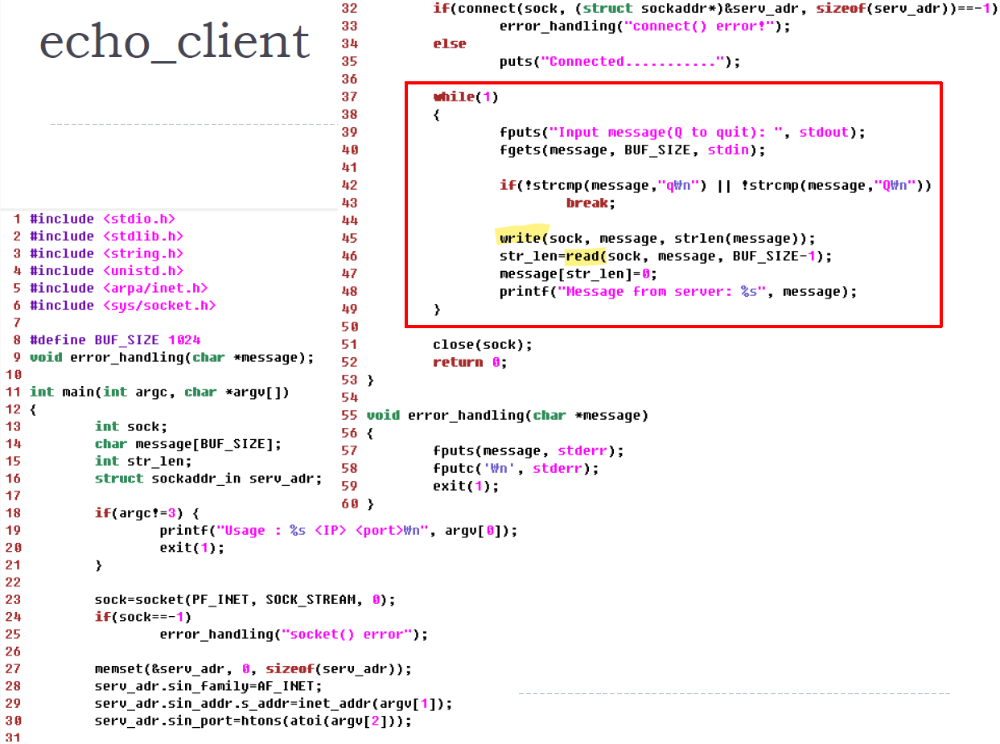
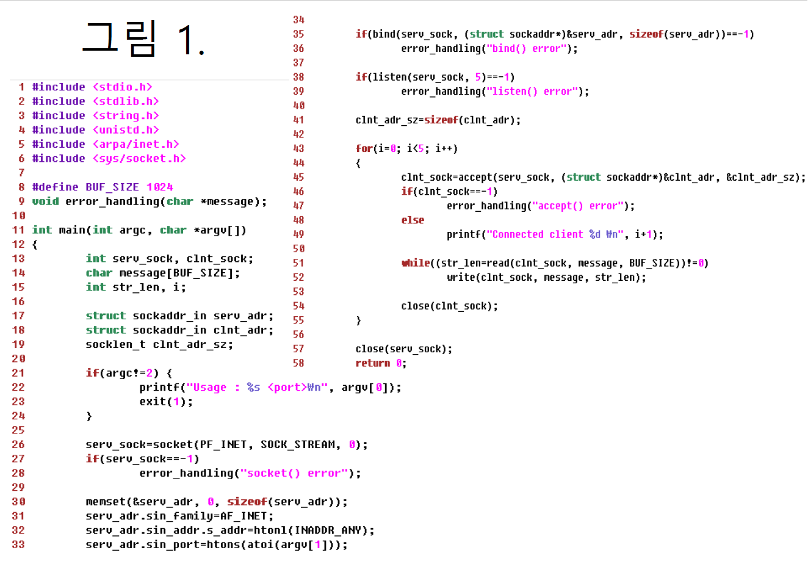
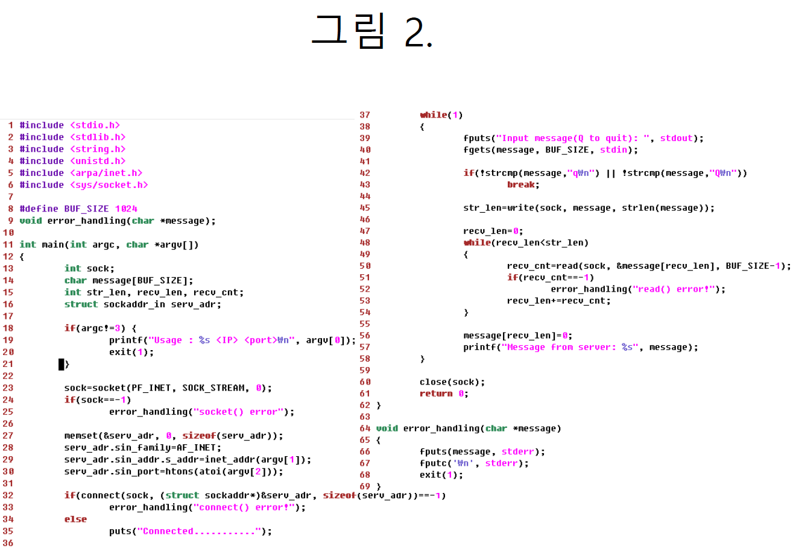

# 네트워크 기초

### 1. IoT란 무엇인가? [22 Fall Mid, 24 Spring Mid]
~~~
사람, 사물, 컴퓨터 등이 연결되어 정보를 생성, 수집, 활용하는 초연결 인터넷
~~~

### 2. Internet Protocol Stack을 구성하는 네트워크 5계층(Physical Layer 외의 계층)을 설명하시오. [24 Spring Mid]
~~~
5계층 Application Layer: HTTP
4계층 Transport Layer: TCP
3계층 Network Layer: IP
2계층 Link Layer: Ethernet
~~~

### 3. frame, packet, segment, datagram 차이점 (최상위 계층 메시지 M을 기준으로 역순서로 내려오면서 차이점을 설명하세요) [24 Spring Mid]
~~~
최상위 계층(Application Layer)에 메시지 M에

1) Transport Layer의 헤더가 추가됨 (SRC/DST port 번호 포함)
    * TCP 헤더: Segment
    * UDP 헤더: Datagram
2) 1에 Network Layer의 헤더가 추가됨 (SRC/DST IP 주소 포함): Packet
3) 2에 Link Layer의 헤더가 추가됨 (SRC/DST MAC 주소 포함): Frame
~~~

### 4. TCP 통신을 하고 있는 host B가 host A로 보내는 패킷안에 sequence number: 200, ACK number: 101이 들어있다고 하자. 이 메시지가 host A로 전달하는 의미가 무엇인지를 설명하시오. [24 Spring Mid]
~~~
B가 전송하는 패킷은 Sequence Number 200으로 시작하는 데이터가 들어있으며,
A로부터 Sequence Number 100까지 성공적으로 수신함
~~~

### 5. TCP flow control은 무엇인가? [24 Spring Mid]
~~~
수신측 버퍼에서 Overflow가 발생하지 않도록,
송신측의 전송 속도를 조절하는 기법
수신 클라이언트가 수행해 주는 제어 기법
~~~

### 6. TCP congestion control은 무엇인가?
~~~
송신 서버의 데이터 전송과 네트워크의 처리 속도 차이로 인한
네트워크 혼잡을 해결하기 위해 전송 속도를 조절하는 기법
송신 서버가 수행해 주는 제어 기법
~~~

### 7. (ARP, DHCP, DNS, HTTP, TCP 각 프로토콜 포함) 웹서버와 웹브라우저간의 인터넷 동작에 대한 질문이다. 그림 2를 보면, 어떤 학교 망에서 노트북으로 네트워크로 무선 접속한 뒤, 웹브라우저를 통해 구글 웹서버에 접속하여 웹서비스를 받으려고 한다. [24 Spring Mid]

#### 7.1. 노트북를 위한 동적 IP 할당부터, 웹 서비스 요청에서 웹서버 응답을 받을 때까지 진행되는 과정을 링크 계층부터 응용계층까지 포함하여 단계별로 설명하시오. 각 과정에서 프로토콜 동작과정을 구체적으로 설명하시오(ARP, DHCP, DNS, HTTP, TCP 동작설명 포함).

참고사항:  
* Application Layer: DHCP, DNS, HTTP
* Transport Layer: TCP
* Network Layer: IP
* Link Layer: ARP

1️⃣ **Step 1.** **DHCP** 프로토콜: 동적 IP 할당  
~~~
노트북이 학교 네트워크에 연결되면, DHCP 서버로부터 IP 주소를 자동으로 받아오게 됨
이를 위해 노트북은 DHCP 요청 메시지에 UDP 헤더를 붙이고, 이 메시지를 이더넷 프레임으로 감싼 뒤 LAN에 브로드캐스팅함

DHCP 서버는 이 이더넷 프레임을 수신한 후, 
그 안에서 IP 패킷과 UDP 데이터그램을 추출해서 DHCP 요청을 확인
요청을 처리한 서버는 응답으로 ACK 메시지를 보내며, 
클라이언트에게 다음 정보를 전달함:
    * 할당된 IP 주소
    * 기본 게이트웨이(첫 번째 라우터)의 주소
    * DNS 서버의 이름과 IP 주소
~~~

2️⃣ **Step 2.** 도메인 www.google.com의 **IP주소를 DNS서버에 요청하여 받음** (**ARP, DNS**)  
~~~
노트북 내 캐시를 검색하여 만일 해당 IP주소가 있다면, 그 IP주소를 사용
그렇지 않을 경우 DNS 서버에 요청

1. 노트북의 웹브라우저에서 DNS 쿼리(DNS query)를 생성하면, 이 쿼리를 DNS 서버로 보내야 함
그런데 인터넷으로 나가기 위해서는 먼저 기본 게이트웨이(First Router)로 이 패킷을 전달해야 함

2. 노트북과 라우터는 같은 서브넷(subnet) 안에 있어서, 데이터를 전송할 때 MAC 주소를 사용해야 함
그러기 위해 노트북은 먼저 라우터의 MAC 주소를 알아야 하고, 이를 위해 ARP 프로토콜을 사용
노트북은 "이 IP 주소를 가진 기기 누구야?" 라는 ARP 요청 메시지를 이더넷 프레임으로 만들어 LAN에 브로드캐스팅

이 요청을 받은 라우터가 자신이 그 IP를 가지고 있다고 응답하면서, 자신의 MAC 주소를 노트북에 알려줌

3. 이제 MAC 주소를 알게 된 노트북은, DNS 쿼리를 담은 패킷을 라우터에 보냄
DNS 쿼리는 UDP 데이터그램에 담겨 있고, 이 전체 메시지는 다시 이더넷 프레임으로 감싸져 MAC 주소를 이용해 라우터로 전송함

4. 라우터는 DNS 서버까지 이 DNS 쿼리 패킷을 전달함
DNS 서버는 이 요청을 처리해서 웹 서버의 IP 주소를 찾아내고, 응답을 통해 노트북에 IP주소를 알려줌
~~~

3️⃣ **Step 3.** HTTP 요청을 웹서버에 보내기 전, **TCP connection을 맺기 위해 3 way handshaking**을 함  
~~~
3 way handshaking 과정:
브라우저가 웹서버에 SYN 패킷을 전송, 웹서버가 SYN + ACK로 응답, 브라우저가 ACK로 응답하여 TCP connection이 맺어짐
~~~

4️⃣ **Step 4.** **HTTP 요청** 및 HTTP 응답 수신  
~~~
HTTP 메소드가 명시된 HTTP 요청을 웹서버에 전달되면, 
웹서버는 브라우저에 HTTP 응답(응답 메시지 + body)을 전송
브라우저는 화면에 응답 결과를 보여줌
~~~

### 8. 패킷 캡슐화(Packet Encapsulation)이란 무엇인가? [22 Fall Mid]
~~~
네트워크 상위 계층에서 하위 계층으로 내려가면서 
필요한 헤더들이 패킷에 추가되는 것을 말함
~~~

# IoT 프로토콜
### 1. 블루투스의 비콘은 무엇인가? [24 Spring Mid]
📌 Beacon 개념:  
~~~
BLE(Bluetooth Low Energy)모드의 블루투스 장치가 
주위의 블루투스 장치에게 connection 없이 
advertising(광고) 패킷을 주기적으로 브로드캐스트하는 통신
~~~

✅ Beacon 특징:  
~~~
1. 저전력: BLE 기반으로 배터리 수명이 김
2. 방향 및 거리 측정 가능: 신호 세기(RSSI)를 활용하여 위치 추정 가능
3. 단방향 브로드캐스트: 연결 없이 신호를 지속적으로 송출
4. 다양한 프로토콜 지원
~~~

### 2. 6LowPAN 프로토콜은 Adaptation(절충) 역할을 담당한다. 이것이 필요한 이유와 이를 구현하는 방법(주요 기능)이 무엇인지 설명하시오. [24 Spring Mid, 22 Fall Mid]
✅ **Adaptation Layer가 필요한 이유:**  
~~~
IPv6는 기본적으로 큰 데이터(MTU 크기: 1280 바이트) 전송을 기대하고 있음
즉, Network Layer(IP)에서 전송할 수 있는 최대 페이로드 크기 (MTU)가 1280 바이트

그런데 IoT 기기들이 쓰는 IEEE 802.15.4 같은 무선 네트워크는 작은 데이터(Frame 최대 크기: 127 바이트)만 전송 가능함
즉, Link Layer에서 전송할 수 있는 최대 데이터 단위 (Frame 최대 크기)가 127 바이트

Adaptation은 이 둘 사이 차이를 절충하는 역할 담당함
~~~

✅ **6LowPAN 주요 기능(구현 방법):**  
~~~
1. 헤더 압축 (IPv6 UDP/ICMP header compression)
    * IPv6의 헤더 40 바이트 -> 헤더를 2 바이트로 줄임

2. 패킷 분할 및 재조립 (Packet Fragmentation & Reassembly)
    * 1280 바이트 같은 큰 IPv6 패킷은 127바이트 단위로 Fragmentation하여 전송
    * 수신 측에서는 Reassembly하여 원래 IPv6 패킷으로 복원함

3. 라우팅 (Routing)
    * 기존의 무거운 IPv6 라우팅 프로토콜 대신, RPL과 같은 경량화된 라우팅 프로토콜 활용
~~~

### 3. MQTT에서 메시지 송수신 방법을 설명하시오(메시지 구분하는 주소 사용 포함). [24 Spring Mid]
~~~
Publisher(송신), Subscriber(수신) 간에 메시지 전달이 이루어며,
둘 사이를 중계하는 Broker가 존재함

메시지를 구분하는 주소로 Topic을 사용하며, 
Subscriber는 특정 Topic을 구독하고 Publisher는 Topic에 메시지를 발행함
~~~

### 4. MQTT와 HTTP 동작 방식의 차이점을 설명하시오(비동기/동기 중 어느 방식인지 설명 포함). [24 Spring Mid]
~~~
MQTT는 비동기식 통신, Broker라는 서버를 중간에 둔 Publisher-Subscriber 구조로 동작
HTTP는 동기식 통신, 클라이언트가 서버에 요청하면 서버가 응답하는 클라이언트-서버 구조로 동작
~~~

### 5. MQTT에서는 client와 서버 사이 메시지 전송함에 있어서 기본적인 QoS 기능을 지원한다. QoS 3 종류(0, 1, 2)를 설명하시오. [22 Fall Mid]
~~~
0: 많아야 한번 전송 (Best Effort, 수신보장 못함)
1: 최소 한번 (ACK가 없으면 재전송, 수신보장)
2: 정확하게 한번 전송 (정교한 메시지 교환, 수신보장)
~~~

### 6. 전송 프로토콜과 웹인터페이스 사용 여부 관점에서, MQTT와 CoAP 차이점을 설명하시오. [24 Spring Mid]
~~~
전송 프로토콜 차이:
    * MQTT: TCP 기반
    * CoAP: UDP 기반

웹인터페이스 사용 여부
    * MQTT: 사용 안함
    * CoAP: 사용함
~~~

### 7. IoT 플랫폼은 무엇인가?
~~~
센서 네트워크, 네트워크, 클라우드 서버 및 응용까지 연결되어,
서비스가 가능하게 해주는 통합 시스템(다중 계층)을 의미함
~~~

### 8. IO multiplexing이란 무엇인가?
~~~
하나의 프로세스(쓰레드)안에서 여러 개의 소켓 IO를 처리하는 것
~~~

### 9. [중요] 블루투스의 Classic Mode와 Smart Mode의 차이점은 무엇인가(에너지 절약, 연결유형, 응용의 관점에서 설명)? [22 Fall Mid]
1. 에너지 절약 관점
~~~
Smart Mode는 저전력으로 동작함
~~~

2. 연결유형 관점:  
~~~
Smart Mode는 
    - 1:N 또는 N:M 연결인 반면,
Classic Mode는 
    - 1:1 연결임
~~~

3. 응용 관점:  
~~~
Classic Mode는 
    - 지속적인 연결 유지의 방식(continuous connections)임
    - 오디오 스트리밍, 데이터 스트리밍에 응용
Smart Mode(BLE)는 
    - 필요할 때만 연결하는 방식(short burst connections)임
    - Beacon, 센서 네트워크에 응용
~~~

### 10. [중요] 블루투스의 Notification과 Indication의 차이는 무엇인가?
~~~
둘다 서버가 클라이언트에게 데이터 변경을 알려주는 전송 방식임에서 동일하지만, 

Notification(알림) 전송 방식은 응답(ACK)이 없는 반면,
Indication(인디케이션) 전송 방식은 응답(ACK)이 필수임
~~~

### 11. 블루투스 장치는 2가지 종류의 장치가 있다. Peripheral과 Central에 대해서 설명하시오.
BLE 장치는 아래의 두 가지 역할을 가짐:  
~~~
퍼리퍼럴(Peripheral)은 데이터를 광고(Advertising)하는 장치
센트럴(Central)은 광고 데이터를 스캔(Scanning)하고 연결하는 장치

즉, Central이 Peripheral을 검색하고 연결하여 데이터를 주고받음
~~~

### 12. GATT란 무엇인가? GATT의 구조에 대해서도 설명하시오.
📌 GATT 개념:  
~~~
BLE에서 장치 간 데이터 교환 방식을 정의하는 프로토콜
즉, 데이터를 어떻게 표현하고 교환할지 프로파일(Profile)을 정한 규칙
~~~

✅ GATT 구조:  
~~~
데이터를 서비스(Service)와 특성(Characteristic) 형태로 저장 및 전송함

사비스(Service): 여러 개의 특성(Characteristic)을 포함
특성(Characteristic): 실제 데이터를 포함
~~~

# 소켓 프로그래밍

### 1. TCP기반 서버 소켓프로그램에서는 socket, bind, listen, accept, read, write, close 함수들이 사용되며, 클라이언트에서는 socket, connect, read, write, close 함수들이 사용된다.
#### 1.1. 서버와 클라이언트 사이의 TCP 3 way handshaking 과정이 일어난다. 이 과정을 소켓함수 중심으로 설명하시오.
~~~
클라이언트의 `connect 함수`, 서버의 `accept 함수`가 호출될 때 3 way handshaking이 수행됨

1. 클라이언트가 먼저 `connect 함수`를 호출하면서 SYN 패킷을 전송하고,
2. 서버가 `accept 함수`를 호출하면서 SYN+ACK 패킷으로 응답하고,
3. 클라이언트가 마지막으로 ACK 응답하여 연결이 맺어짐
~~~

#### 1.2. 서버에서 두 종류의 소켓이 사용된다. 각각 언제 생성되는지 소켓함수 중심으로 설명하고 각 소켓의 용도를 설명하시오.
~~~
socket 함수 호출로 서버 소켓이 생성됨
listen 함수 호출로 서버 소켓이 활성화됨
accept 함수 호출 후 클라이언트 소켓이 생성됨

서버 소켓(리스닝 소켓): 연결 요청을 관리하는 용도로 사용됨
클라이언트 소켓: 연결되는 해당 클라이언트와의 데이터 송수신 용도로 사용됨
~~~

#### 1.3. 서버에서 연결요청 대기실(큐)을 운영하는데 (1) 이게 생성되는 순간은 언제인가? (2) 이 대기실에 연결요청이 추가되는 순간은 언제인가? (3) 대기중인 연결요청이 수락되는 시점은 언제인가?
~~~
(1) listen 함수 호출시 연결요청 대기 큐가 생성됨
(2) connect 함수 호출시 연결요청이 추가됨
(3) accept 함수 호출시 연결요청이 수락됨
~~~

#### 1.4. 클라이언트 코드에서 socket 함수를 call한 뒤, bind 함수 call 없이 바로 connect 함수를 call 한다. 그렇다면 클라이언트 소켓에 클라이언트의 IP 및 Port 주소는 언제 누가 어떻게 할당하는지 설명하시오.
~~~
(1) 언제:
    connect 함수를 호출할 때,

(2) 누가:
    운영체제가 

(3) 어떻게:
    IP주소는 Host에 할당된 주소, Port는 임의로 할당함
~~~

**참고:**  
~~~
참고로, 클라이언트 소켓 프로그래밍 코드에서 
sockaddr 구조체에 들어가는 주소 정보는 서버의 주소 정보
~~~

#### 1.5. 서버 코드에서 클라이언트 소켓 닫는 close(clnt_sock)을 수행 전, shutdown(clnt_sock, SHUT_WR)를 별도로 수행할 수 있다. 이 shutdown 함수 기능을 설명하고 왜 필요한지를 설명하시오.
~~~
shutdown 함수를 통해 읽기는 열어두고 쓰기는 종료하는 half close가 가능함
클라이언트 측에 종료를 알리고, 클라이언트가 보낸 데이터는 읽을 수 있음
즉, 남은 데이터를 모두 처리하고 연결을 종료하는 half-close의 우아한 종료 가능
~~~

### 2. Stream과 Datagram의 차이점을 설명하시오.
~~~
Stream은 바이트 단위로 처리하는 방식의 TCP 프로토콜 (Connection-oriented)
    순서대로 도착하며, 신뢰성이 높음
Datagram은 패킷 단위로 처리하는 방식의 UDP 프로토콜 (Connectionless)
    순서가 바뀔 수 있으며, 신뢰성이 낮음
~~~

### 3. Little Endian 시스템에서 아래 코드를 수행했을 때 결과와 htons, htonl 역할을 설명하시오.
**코드:**    
~~~
#include <stdio.h>
#include <arpa/inet.h>

int main() {
    unsigned short a = 0x1234;
    unsigned int b = 0x12345678;

    unsigned short net_a = htons(a);
    unsigned int net_b = htonl(b);

    printf("htons(0x1234) = 0x%04x\n", net_a);
    printf("htonl(0x12345678) = 0x%08x\n", net_b);

    return 0;
}
~~~

🎯 **수행 결과:**  
~~~
htons(0x1234) = 0x3412  
htonl(0x12345678) = 0x78563412
~~~

🎯 **htons와 htonl의 역할:**  
~~~
Host Byte Order → Network Byte Order (Big Endian)으로 변환해주는 역할
둘 다 네트워크 전송을 위한 Big Endian 변환이 목적임
~~~

✅ **htons와 htonl의 차이:** 
~~~
htons()는 16비트용(Short), htonl()는 32비트용(Long) 바이트 순서 변환 함수

htonl은 IP 주소 정보를 Big Endian으로 변환할 때 사용,
htons는 Port 정보를 Big Endian으로 변환할 때 사용
~~~

### 4. connect 함수가 수행됐다면, 서비스가 동작한다고 할 수 있는가? 이유와 함께 설명하시오.
~~~
connect 함수가 수행됐다는 것은 서버의 연결 요청 대기 큐에 등록된 상황만을 의미함

서버의 accept 함수호출을 의미하는 것은 아니므로, connect 함수가 반환했더라도 당장 서비스가 이루어지지 않을 수 있음
~~~

### 5. 다음 에코 클라이언트 코드의 문제점을 설명하고, 문제점을 수정한 코드를 제시하시오.
  
✅ **문제점:**  
~~~
45 ~ 46번 라인의 코드가 잘못되었음

이 코드에는 read 호출로 서버에서 전송된 문자열을 전체를 읽을 것이라는 가정을 하고 있음
그러나 실제로는 TCP에는 데이터에 경계가 없으며, 서버가 전송한 문자열의 일부만 읽힐 수 있음
~~~
✅ **해결책:**
~~~
write 함수를 통해서 전송한 데이터 길이(str_len)만큼 읽어 들이기 위한 반복문 삽입이 필요함
~~~

🎯 **수정 코드:**  
45 라인부터 57 라인까지 다음 코드로 대체  
~~~
    # 전송한 데이터 길이만큼 읽도록 하기 위해, 전송한 데이터 길이를 strlen 변수에 저장
    strlen = write(sock, message, strlen(message));
    while(recv_len < str_len)
    {
        recv_cnt = read(sock, message, BUF_SIZE=-1);

        # read에 대한 에러 핸들링 필요
        if (recv_cnt == -1) 
            error_handling("recv error");
        
        # 수신한 길이에 read로 읽은 크기 누적
        recv_len += recv_cnt;
    }
    message[str_len]=0;
    printf("Message from server:%s", message);
~~~

### 6. 서버에 있는 파일을 클라이언트에 전송하는 서버 및 클라이언트 소켓 프로그램 작성하여라. 아래 그림 1과 2의 코드를 사용할 수 있다. 코드를 추가하거나 수정하여 그 밑에 본인 코드를 추가하여라. [22 Fall Mid]
~~~
HW2의 변형, 아래 조건을 만족할 것:

- 예, "그림 1의 1번줄 ~ 33번줄 코드 사용" 표기
- 서버와 클라이언트 간의 1:1 통신으로 가정
- 클라이언트는 사용자로부터 전송받을 파일의 이름을 입력받는다
- 클라이언트는 서버에게 해당 파일 이름을 전송한다 (파일전송 요청)
- 서버내 그 파일이 존재할 경우 서버는 파일을 전송하고, 파일이 존재하지 않을 경우 연결을 종료한다
- 파일크기는 버퍼의 크기(예:1024)를 초과하지 않는다고 가정
- 아래 C언어 표준 파일 입출력함수를 사용 (check empty file 및 flush for stdout buffer 동작 필요없다고 가정, fseek, fflush 불필요)
    FILE *fopen(const char *path, const char *mode);
    size_t fread(void *ptr, size_t size, size_t nmemb, FILE *stream);
    size_t fwrite(const void *ptr, size_t size, size_t nmemb, FILE *stream);
    int fclose(FILE *fp);
~~~
  
  
  
  
**server.c 코드:**  
~~~
//그림 1의 1번줄 ~ 41번줄 코드 사용

//1. accept 연결요청 수락
    clnt_sock=accept(serv_sock, (struct sockaddr*)&clnt_adr, &clnt_adr_sz);
    if(clnt_sock==-1)
        error_handling("accept() error");
    else
        printf("Client connected...");

//2. 파일 이름 수신
    read_cnt= read(clnt_sock, message, BUF_SIZE);
    message[read_cnt] = 0;

//3. 파일 읽고 전송
    fp = fopen(message, "rb");
    if(fp == NULL)
        error_handling("File open error");
    
    while((read_cnt = fread(message, 1, BUF_SIZE, fp)) > 0)
        write(clnt_sock, message, read_cnt);

    printf("File sent successfully.\n");

    fclose(fp);
    close(clnt_sock);
    close(serv_sock);
    return 0;
~~~
  
**client.c 코드:**  
~~~
//그림 2의 1번줄 ~ 35번줄 코드 사용

//1. 파일 이름 전송
    write(sock, argv[3], strlen(argv[3]));

//2. 동작 디렉토리에 파일 생성
    fp = fopen(argv[3], "wb"); 
    if(fp == NULL)
        error_handling("File open error");

//3. 파일 내용 수신
    while((read_cnt = read(sock, message, BUF_SIZE)) > 0)
        fwrite(message, 1, read_cnt, fp);

    printf("File received successfully.\n");

    fclose(fp);
    close(sock);
    return 0;
~~~

### 7. 아래 소켓 옵션의 의미를 구체적으로 설명하시오(세팅 결과에 따라 TCP 동작이 어떻게 바뀌는지 설명). [24 Spring Mid]
~~~
int opt_val=1;
setsockopt(sock, IPPROTO_TCP, TCP_NODELAY, (void*)&opt_val, sizeof(opt_val));
~~~

**소켓 옵션의 의미:**  
~~~
(1) TCP_NODELAY를 1로 활성화하면:
Nagle 알고리즘 적용을 멈추게 함.

(2) Nagle 알고리즘 개념:
데이터가 MSS만큼 쌓이거나, 이전 데이터에 대한 ACK 받았을 때
데이터 전송함으로써 네트워크 트래픽 양을 제어함 (네트워크 혼잡 방지)

(3) Nagle 알고리즘 적용을 멈추게 하면:
작은 크기의 데이터라 할지라도 바로바로 전송하여 응답시간이 빨라짐
~~~

### 8. 서버 프로그램 종료 후 재실행 시 bind 에러가 발생하는 이유를 설명하시오(Time-wait).
**발생 이유:**
~~~
TCP에서 연결 종료를 목적으로 하는 Four-way handshaking 과정의 
마지막 ACK를 전송하는 호스트에서 ACK가 소멸되는 상황을 대비하여 Time-wait을 거침

이 Time-wait을 위해 커널은 지역주소(IP, Port 정보)를 점유하고 있음 
Time-wait 상태에 있는 Port의 재할당이 가능하도록 SO_REUSEADDR 소켓 옵션을 설정해야 함
~~~

`SO_REUSEADDR` 소켓 옵션 사용:  
~~~
optlen=sizeof(option);
option=TRUE;
setsockopt(serv_sock, SOL_SOCKET, SO_REUSEADDR, (void*)&option, optlen);
~~~

### 9. 그림 1과 2는 소켓프로그램 예제이다. [22 Fall Mid]
  
  

### 9.1. 그림 1에서 socket(26번), bind(35번), listen(38번), accept(45번), close(57번)의 기능을 각각 1-2줄로 설명하시오. 그림 2에서 connect(32번) 기능을 1-2줄로 설명하시오. 
~~~
socket: 프로토콜 관련 정보를 받아 소켓을 생성하고 소켓 fd를 리턴
bind: 서버 IP, port의 주소 정보를 소켓에 할당
listen: 해당 소켓을 연결요청 가능한 상태로 변경하고, 연결요청 대기큐를 만들어 줌
accept: 클라이언트 연결요청을 수락하고 해당 클라이언트와 데이터 송수신을 담당할 클라이언트용 소켓 생성
close: 통신이 모두 끝나서 소켓 소멸
connect: 클라이언트에서 서버에게 연결요청
~~~

### 9.2. 그림 1 listen 함수(38번), accept 함수(45번), 그림 2 connect 함수들 사이 종속관계를 설명하시오. (예를 들어, connect 함수 수행 전 listen 함수, accept 함수 둘 다 반드시 수행되어야 하는가?)
~~~
1. listen 함수는 반드시 connect 함수보다 먼저 호출되어야 함
2. accept 함수는 connect 함수 수행 전 혹은 후에 수행해도 됨
    (연결 요청은 커널 큐에 저장되므로, 순서 유연함)
    * 서버가 먼저 accept() 호출: 서버는 블로킹 상태로 클라이언트를 기다림
    * 클라이언트가 먼저 connect() 호출: 커널이 연결요청을 대기큐에 저장해둠
~~~

### 9.3. 그림 1의 32번줄, 33번줄 htonl, htons 함수의 기능은 무엇인가?
`htonl` 함수 기능:  
~~~
"long type 호스트 바이트 순서"인 주소를 
"long type 네트워크 바이트 순서"인 주소로 변환함
~~~

`htons` 함수 기능:  
~~~
"short type 호스트 바이트 순서"인 주소를 
"short type 네트워크 바이트 순서"인 주소로 변환함
~~~

### 9.4. 그림 1의 32번줄 argument인 INADDR_ANY의 의미는? (host IP를 argument로 입력한 것과 차이점을 설명)
~~~
하나의 Host가 여러 NIC를 사용하여 여러 IP 주소를 사용할 수 있음

1. INADDR_ANY는 Host의 여러 IP 중 어떤 IP로 오더라도 데이터 수신이 가능하도록 함
2. 특정 Host IP를 지정하면 해당 IP로만 데이터 수신 가능
~~~

### 9.5. 그림 1의 TCP 서버 프로그램을 UDP 서버 프로그램으로 바꾸려 한다. 소켓 함수들 관점에서 바뀌는 내용을 설명하시오.
~~~
1. socket 함수의 argument를 SOCK_STREAM에서 SOCK_DGRAM으로 변경

2. listen 및 accept 함수 제거

3. read 함수를 recvfrom 함수로 교체

4. write 함수를 sendto 함수로 교체
~~~